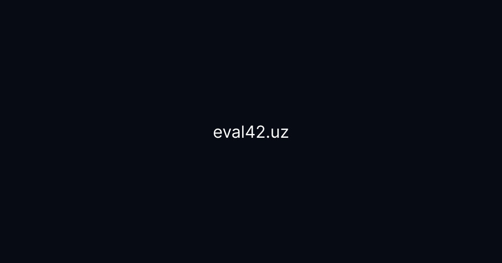

<div align="center">



<br />

<h1>eval42<sub>_</sub></h1>

<strong>Omonbek Khujamurodov</strong> — Frontend Engineer uchun yaratilgan kinematik shaxsiy portfolio va xizmatlar sayti.<br/>
Next.js App Router, custom cursor, scroll-driven animatsiyalar va real product case'lar asosida qurilgan.

<br /><br />

[](https://nextjs.org)
[](https://react.dev)
[](https://www.typescriptlang.org)
[](https://tailwindcss.com)

[**Live sayt**](https://eval42.uz) · [**Telegram**](https://t.me/eval42) · [**LinkedIn**](https://www.linkedin.com/in/omonbekxojamurodov/) · [**GitHub**](https://github.com/omonboyweb)

</div>

<br />

## Sayt haqida

**Eval42** — Omonbek Khujamurodovning shaxsiy portfolio sayti. Sayt frontend
muhandislik, performance optimallashtirish, xavfsiz web arxitektura va motion
dizayn qobiliyatlarini bitta sahifada — jonli, interaktiv tajriba orqali
namoyish etadi.

Bu klassik "statik" portfolio emas: sahifaning o'zi ham bir case study.
Custom cursor, preloader, fog/particle effektlar, scroll bilan boshqariladigan
gorizontal galereya va matrix-style animatsiyalar — barchasi saytning o'zi
qanday ishlay olishini ko'rsatish uchun qo'lda yozilgan.

```text
IDEAS,
COMPILED.
```

## Sahifa tarkibi

Landing page bitta `app/page.tsx` ichida quyidagi bo'limlar ketma-ketligidan
iborat ([app/page.tsx](app/page.tsx)):

| # | Bo'lim | Komponent | Nima qiladi |
|---|--------|-----------|-------------|
| 00 | **Hero** | [`components/hero/hero.tsx`](components/hero/hero.tsx) | Fog canvas fon, harf-harf split-text animatsiya, sichqoncha parallaksi |
| — | **Marquee** | [`components/marquee.tsx`](components/marquee.tsx) | Uzluksiz aylanuvchi ko'rsatkichlar tasmasi |
| — | **Manifesto** | [`components/manifesto.tsx`](components/manifesto.tsx) | Scroll progress bo'yicha so'zma-so'z yorishadigan matn |
| 01 | **Selected Work** | [`components/work/work-gallery.tsx`](components/work/work-gallery.tsx) | Scroll-driven gorizontal case-study galereyasi (HalalHub, Infodeck, Homex) |
| 02 | **Services** | [`components/services/services-live.tsx`](components/services/services-live.tsx) | Avtomatik almashinadigan, jonli "live preview" xizmatlar paneli |
| — | **Stats** | [`components/stats-band.tsx`](components/stats-band.tsx) | Animatsion sanoq + yashirin "Matrix rain" easter egg (42 raqamiga bosing) |
| 03 | **Contact** | [`features/contacts/contacts.tsx`](features/contacts/contacts.tsx) | 3 bosqichli forma → Telegram bot orqali xabar |
| — | **Outro** | [`components/outro.tsx`](components/outro.tsx) | Yopilish bo'limi |

### Case study'lar (Selected Work)

| Loyiha | Soha | Bozor | Havola |
|--------|------|-------|--------|
| **HalalHub** | Halal food delivery | 🇺🇸 AQSH | [wehalalhub.com](https://wehalalhub.com) |
| **Infodeck** | O'quv markazlari uchun boshqaruv tizimi | 🇺🇿 O'zbekiston | Ichki tizim |
| **Homex** | Ustalar va mijozlar uchun marketplace | 🇺🇿 O'zbekiston | Brend identifikatsiya |

## Asosiy imkoniyatlar

- 🎬 **Kinematik UX** — preloader, custom cursor va chrome overlay ([`components/fx/`](components/fx)) sahifa yuklanishidan boshlab tajribani boshqaradi.
- 🖱️ **Scroll-driven animatsiyalar** — [`lib/fx.tsx`](lib/fx.tsx) ichidagi `Reveal`, `SplitText`, `useSpotlight`, `useTilt`, `useMagnet` kabi custom hook'lar orqali.
- 🖼️ **Gorizontal case-study galereyasi** — vertikal scroll gorizontal harakatga aylantiriladi, har bir loyiha uchun jonli statistika chip'lari bilan.
- 🧭 **Jonli xizmatlar paneli** — dashboard, performance, xavfsizlik va motion — har biri o'z mini-demo "screen"iga ega.
- 📊 **Animatsion statistika tasmasi** — foydalanuvchilar soni, uptime va yashirin Matrix-rain easter egg.
- 📮 **Ko'p bosqichli kontakt forma** — validatsiya + honeypot spam-himoya + Telegram bot integratsiyasi ([`actions/telegram.ts`](actions/telegram.ts)).
- 🔍 **To'liq SEO tayyorgarlik** — metadata, Open Graph, Twitter card, JSON-LD (`Person` + `WebSite`), `sitemap.ts`, `robots.ts`.
- 🔤 **Lokal SF Pro Display** shrift oilasi va optimallashtirilgan `next/image` assetlari.
- 📈 **Google Analytics** — `@next/third-parties` orqali ulangan.

## Texnologiyalar

<div>

| Kategoriya | Texnologiya |
|---|---|
| Framework | [Next.js 16](https://nextjs.org) (App Router) |
| UI kutubxona | [React 19](https://react.dev) + [TypeScript 5](https://www.typescriptlang.org) |
| Stillar | [Tailwind CSS 4](https://tailwindcss.com), `tw-animate-css` |
| UI primitivlar | [Radix UI](https://www.radix-ui.com), `class-variance-authority`, `tailwind-merge` |
| Ikonalar | [lucide-react](https://lucide.dev) |
| Analitika | [`@next/third-parties`](https://www.npmjs.com/package/@next/third-parties) (Google Analytics) |
| Backend aloqa | Next.js Server Actions → Telegram Bot API |

</div>

## Talablar

Next.js 16 uchun kamida **Node.js 20.9** talab qilinadi. Loyihada
`package-lock.json` bor, shuning uchun lokal ishda `npm` ishlatish tavsiya
qilinadi.

## Boshlash

```bash
# 1. Repozitoriyani klonlash
git clone https://github.com/omonboyweb/eval42.git
cd eval42

# 2. Bog'liqliklarni o'rnatish
npm install

# 3. Dev serverni ishga tushirish
npm run dev
```

Dev server odatda quyidagi manzilda ochiladi:

```text
http://localhost:3000
```

## Environment sozlamalari

Loyiha ildizida `.env.local` fayl yarating:

```env
NEXT_PUBLIC_SITE_URL=https://eval42.uz
NEXT_PUBLIC_GA_MEASUREMENT_ID=G-XXXXXXXXXX
TELEGRAM_BOT_TOKEN=your-telegram-bot-token
TELEGRAM_CHAT_ID=your-telegram-chat-id
```

> **Eslatma:** `NEXT_PUBLIC_` prefiksli qiymatlar Next.js build vaqtida
> client bundle ichiga kiritiladi, shuning uchun Telegram bot tokeni va
> chat ID **prefikssiz** saqlanadi va faqat server action ichida
> ([`actions/telegram.ts`](actions/telegram.ts)) o'qiladi — brauzerga hech
> qachon chiqmaydi.

## Skriptlar

| Buyruq | Vazifasi |
|---|---|
| `npm run dev` | Development serverni ishga tushiradi |
| `npm run build` | Production build yaratadi |
| `npm run start` | Production build'ni ishga tushiradi |
| `npm run lint` | ESLint orqali kod sifatini tekshiradi |

## Loyiha tuzilmasi

```text
app/
  layout.tsx              Global layout, metadata, JSON-LD, shriftlar, GA
  page.tsx                 Asosiy landing page (barcha bo'limlar shu yerda birlashadi)
  globals.css              Global stillar va animatsiya klasslari
  robots.ts                Robots konfiguratsiyasi
  sitemap.ts                Sitemap konfiguratsiyasi

components/
  fx/                       Preloader, custom cursor, chrome overlay
  hero/                     Hero bo'limi + fog canvas fon effekti
  work/                     Gorizontal scroll case-study galereyasi
  services/                 Jonli, avtomatik almashinadigan xizmatlar paneli
  manifesto.tsx             Scroll bilan yorishadigan matn bo'limi
  marquee.tsx                Aylanuvchi ko'rsatkichlar tasmasi
  stats-band.tsx            Statistika + Matrix-rain easter egg
  outro.tsx                  Yopilish bo'limi

features/
  contacts/                Ko'p bosqichli kontakt formasi

actions/
  telegram.ts               Telegram bot orqali forma xabarini yuborish

layouts/
  header.tsx                 Navigatsiya, mobil menyu, CV havolasi
  footer.tsx                  Ijtimoiy tarmoqlar va Toshkent vaqti

lib/
  fx.tsx                     Scroll/animatsiya uchun umumiy hook va helper'lar
  utils.ts                    `cn()` va boshqa yordamchi funksiyalar

public/
  fonts/                     SF Pro Display shrift fayllari (.otf)
  *.png, *.webp               Case-study va OG rasm assetlari
  Omonbek_Frontend_Developer_CV.pdf   Yuklab olinadigan CV
```

## Production build

```bash
npm run build
npm run start
```

## Deployment

Loyiha [Vercel](https://vercel.com) yoki istalgan Node.js serverda ishga
tushirish uchun tayyor. Deploy qilishdan oldin:

1. Production environment o'zgaruvchilarini platformada sozlang.
2. `npm run build` buyrug'i xatosiz o'tishini tekshiring.
3. `NEXT_PUBLIC_SITE_URL` qiymati haqiqiy domenga mos kelishini tasdiqlang (metadata va sitemap shu qiymatga tayanadi).

## Kontakt

<div>

[](https://eval42.uz)
[](https://t.me/eval42)
[](https://github.com/omonboyweb)
[](https://www.linkedin.com/in/omonbekxojamurodov/)
[](https://www.instagram.com/omonbek_khojamurodov/)

</div>

<div align="center">
<sub>© 2026 eval42 — Tashkent, UZ</sub>
</div>
